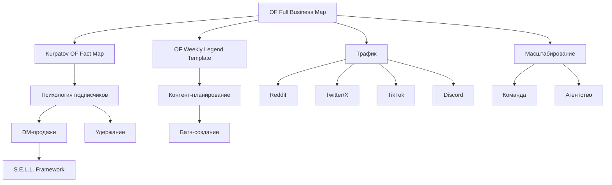

# OnlyFans — Полная карта бизнеса с нуля (2026)

> Полноценная карта: от регистрации до $50K/мес. Все фишки, стратегии, метрики, скрипты. Ничего не пропущено.

**Связанные материалы:**
- [[Kurpatov OF Fact Map]] — психология подписчиков (21 факт)
- [[OF Weekly Legend Template]] — шаблон еженедельной легенды

---

## Оглавление

1. [[#1. Старт с нуля — Регистрация и запуск]]
2. [[#2. Выбор ниши и позиционирование]]
3. [[#3. Ценообразование и монетизация]]
4. [[#4. Контент-стратегия]]
5. [[#5. Оборудование и качество]]
6. [[#6. Трафик и маркетинг]]
7. [[#7. Free Trial Links (FTL) — Воронка конверсий]]
8. [[#8. DM-продажи и чаттинг]]
9. [[#9. Аналитика и KPI]]
10. [[#10. Безопасность и приватность]]
11. [[#11. Юридическая сторона]]
12. [[#12. Команда и масштабирование]]
13. [[#13. Психология подписчиков]]
14. [[#14. Удержание и снижение оттока]]
15. [[#15. Ниши — особенности и стратегии]]
16. [[#16. Агентство — когда и зачем]]
17. [[#17. Кризис-менеджмент]]
18. [[#18. Таймлайн роста — реалистичные ожидания]]
19. [[#19. Инструменты и софт]]
20. [[#20. Чек-листы]]

---

## 1. Старт с нуля — Регистрация и запуск

### Регистрация аккаунта
- Зайти на onlyfans.com → Create Account
- **Username**: профессиональный, легко запоминается, без цифр/символов
- **Верификация**: паспорт/ID + подтверждение адреса → 48-72 часа
- **Платёжный метод**: банковский счёт или PayPal для выплат
- OF берёт **20%** со всех доходов, тебе остаётся **80%**

### Настройка профиля
| Элемент | Требования |
|---------|-----------|
| Фото профиля | Качественное, лицо видно, хороший свет |
| Обложка | Отражает нишу, бренд-aligned |
| Bio | 150 символов, чётко про нишу |
| Цена подписки | $4.99–$49.99 (начинай с $0 или $9.99) |

### Стоимость старта: **$0**
- Бесплатно создать аккаунт
- Бесплатно загружать контент
- Платишь только когда зарабатываешь
- Можно снимать на телефон + бесплатный софт (CapCut, DaVinci Resolve)

### Первые шаги после верификации
1. Подготовить **30+ постов** до запуска (чтобы страница не выглядела пустой)
2. Настроить PPV (pay-per-view)
3. Создать tip-меню
4. Написать приветственное сообщение для новых подписчиков
5. Начать промо в тот же день — не ждать "идеального момента"

> **Главная ошибка новичка**: перфекционизм → не запускаться. Consistency > perfection.

---

## 2. Выбор ниши и позиционирование

### Принцип выбора ниши
Ниша = ответ на "О чём мой OnlyFans?"

**Критерии выбора:**
- Тема, о которой можешь говорить часами
- Уже есть аудитория на других платформах
- Можешь постить 5-7 раз в неделю стабильно
- Есть неудовлетворённый спрос (не перенасыщена)

### Самые быстрорастущие ниши (2026)

| Ниша | Особенность | Средняя цена подписки |
|------|------------|----------------------|
| Fitness/Gym | Высокий engagement, стабильный спрос | $12.99–$19.99 |
| Cosplay/Anime | Лояльная аудитория, высокий PPV | $9.99–$14.99 |
| MILF/Mature | Премиум ценообразование | $14.99–$24.99 |
| Alt/Goth | Премиум за уникальность | $9.99–$14.99 |
| Couples | Очень высокий PPV | $14.99–$29.99 |
| Domme/Findom | 2-3x выше средний чек | $19.99–$49.99 |
| Feet | Стабильный рынок, $5K+/мес | $9.99–$14.99 |
| ASMR | Повторные просмотры | $9.99–$14.99 |
| Girl Next Door | Широкая аудитория, relatable | $9.99–$14.99 |
| E-Girl/Gamer | Twitch → OF воронка | $9.99–$14.99 |

### Позиционирование
Вместо "Я делаю фитнес" → "Я помогаю занятым профессионалам построить мышцы за 30 минут в день с научным подходом"

**Специфичность** = правильная аудитория + премиум ценообразование

### Брендинг
- **Визуальная идентичность**: единый стиль, цвета, шрифты
- **Тон общения**: определить 1 раз и придерживаться
- **Hex-коды**: розовый +25% engagement (тестировано)
- **Никнейм**: одинаковый через все платформы

---

## 3. Ценообразование и монетизация

### 6 потоков дохода

```
┌─────────────────────────────────────────────────┐
│ 1. Подписка (MRR)          │ $4.99-$49.99/мес   │
│ 2. PPV (Pay-Per-View)      │ $5-$100+           │
│ 3. Tips (Чаевые)           │ $5-$100            │
│ 4. Custom Content          │ $75-$300+          │
│ 5. Bundles (Пакеты)        │ 15-35% скидка      │
│ 6. Free Trial → Конверсия  │ Воронка            │
└─────────────────────────────────────────────────┘
```

### Стратегия ценообразования подписки

| Уровень | Рекомендуемая цена | Конверсия | Для кого |
|---------|-------------------|-----------|----------|
| Новичок (0-3 мес) | $4.99–$9.99 | 20-30% | Набор базы |
| Растущий (3-12 мес) | $9.99–$14.99 | 15-25% | Баланс роста и дохода |
| Устоявшийся (1+ год) | $14.99–$24.99 | 10-20% | Максимизация дохода |
| Премиум/Селебрити | $24.99–$49.99 | 5-15% | Эксклюзивный контент |

**Sweet spot: $9.99**
- Психология: "меньше $10" = импульсная покупка
- Средняя конверсия: 22%
- Подписчики на этой цене охотнее покупают PPV

### PPV — ценообразование по типу контента

| Тип контента | Цена | Buy Rate |
|-------------|------|----------|
| Одно фото (тизер) | $5–$10 | 30-45% |
| Фото-сет (5-10 фото) | $15–$25 | 25-35% |
| Короткое видео (1-3 мин) | $20–$35 | 20-30% |
| Длинное видео (5-10 мин) | $35–$60 | 15-25% |
| Премиум видео (10+ мин) | $50–$100 | 10-18% |
| Custom контент | $75–$300+ | 5-12% |

**Правило 3x**: Премиум PPV = 3-5x цены подписки. Если подписка $9.99 → PPV $30-$50

**Никогда ниже $5** — ниже = сигнал низкой ценности

### Tip-меню (Чаевые)

```
💵 $5  — Твоё имя в благодарственном посте
💵 $10 — Персональная голосовая заметка
💵 $20 — Эксклюзивное фото за кулисами
💵 $50 — 5-минутное кастомное видео с твоим именем
💵 $100 — 10-минутное кастом видео + рейтинг
```

Tips = +40% к месячному доходу при правильной оптимизации

### Bundles (Пакеты подписки)

| Пакет | Скидка | Эффект |
|-------|--------|--------|
| 3 месяца | 15% | Самый популярный |
| 6 месяцев | 25% | Лучший для удержания |
| 12 месяцев | 35% | Только суперфаны |

Bundles = +30% retention

### Free vs Paid страница (для новичков)
- **Рекомендация**: начинай с FREE ($0 подписки)
- Убирает барьер входа
- Монетизация через PPV
- Free-first креаторы зарабатывают **3-5x** больше в среднем
- После 100+ подписчиков можно вводить платные тиры

### Формула дохода (из [[Kurpatov OF Fact Map]])
```
APC × APV = ARPPU
(Среднее кол-во покупок) × (Средний чек) = Доход на спендера

Пример: APC 4.5 × APV $25 = $112.50 ARPPU
Для $10K/мес нужно: 89 спендеров
При конверсии 3%: ~3,000 фанов/мес = 99 фанов/сутки
```

---

## 4. Контент-стратегия

### Оптимальная частота постинга
| Тип | Частота | Назначение |
|-----|---------|-----------|
| Timeline посты | 1-3 раза/день | Основной контент |
| Mass Messages (PPV/Free) | 3-5 раз/неделю | Прямой драйвер дохода |
| Stories | Ежедневно | Быстрые обновления, engagement |

### Лучшее время для постов (EST)
- **Утро**: 9-11 AM — ранние пташки, коммьют
- **Обед**: 12-2 PM — высокий engagement на перерыве
- **Вечер**: 7-10 PM — пик активности
- **Ночь**: 11 PM - 1 AM — международная аудитория

> Pro tip: Смотри свою аналитику OF — реальные данные важнее общих гайдлайнов

### 6 контент-пиллеров (столпов)

| Пиллер | Доля | Описание |
|--------|------|----------|
| Signature Style | 30-40% | Твой основной оффер |
| Behind-the-Scenes | 15-20% | Личная связь |
| Themed/Fantasy | 20-25% | Костюмы, ролеплеи, сценарии |
| Interactive | 10-15% | Опросы, Q&A, запросы фанов |
| Seasonal/Trending | 10-15% | Праздники, тренды |
| Exclusive/Premium | 10-15% | Высокоценный контент для PPV |

### Формула 30/30/30/10
- **30%** — Signature content (основной стиль)
- **30%** — Themed/variety (разнообразие)
- **30%** — Interactive + BTS (вовлечение)
- **10%** — Premium PPV (монетизация)

### Батч-создание контента (30 дней за 1 день съёмки)

**День 1 — Подготовка + Съёмка (8-11 часов)**
- Подготовка: аутфиты, реквизит, локации (2 часа)
- Съёмка недели 1+2 фото-сеты (4-6 часов)
- Съёмка 2-3 видео (2-3 часа)

**День 2 — Съёмка (7-11 часов)**
- Съёмка недели 3+4 фото-сеты (4-6 часов)
- Съёмка 2-3 видео (2-3 часа)
- BTS и filler-контент (1-2 часа)

**День 3 — Пост-продакшн (7-9 часов)**
- Редактирование фото (3-4 часа)
- Редактирование видео (3-4 часа)
- Планирование + загрузка в шедулер (1-2 часа)

### Месячный план (пример)

```
Неделя 1: [Тема — напр. "Lingerie Week"]
  Пн: Timeline (Pillar 1) + Mass Message PPV
  Вт: Timeline (Pillar 2) + Timeline (Pillar 1)
  Ср: Timeline (Pillar 3) + Mass Message PPV
  Чт: Timeline (Pillar 1) + Timeline (Pillar 4)
  Пт: Timeline (Pillar 5) + Mass Message PPV
  Сб: Timeline (Pillar 1) + Timeline (Pillar 3)
  Вс: Timeline (Pillar 6) + Special Sunday PPV

Неделя 2: [другая тема — "Outdoor/Natural"]
Неделя 3: ["Glamour/High Fashion"]
Неделя 4: ["Fan Favorites/Requests"]
```

### Custom Content — Стратегия

**Ценообразование кастомов:**
- Базовый кастом (2-3 мин видео): $75-$150
- Премиум кастом (5-10 мин): $150-$300
- Ультра-премиум (10+ мин, сложный): $300+

**Правила:**
1. Чёткие границы: что делаешь / что НЕ делаешь
2. Предоплата 100% (всегда)
3. Дедлайн: 3-7 дней на выполнение
4. Ватермарки обязательно
5. Можно перепродать как PPV (если клиент не платил за эксклюзив)

**50+ идей контента, которые продаются:**
- Утренняя рутина
- Фитнес/тренировка
- Примерка нижнего белья
- GRWM (Get Ready With Me)
- Ответы на вопросы
- Рейтинг по запросу
- Кулинария в бикини
- Ролеплей по запросу
- JOI/аудио-контент
- Челлендж/спор с другим креатором

---

## 5. Оборудование и качество

### Главный инсайт
> 90% топ 1% креаторов снимают на iPhone 15/16 Pro или Samsung S25 Ultra.
> Секрет — не камера, а **3-точечный свет**.
> $200 телефон с хорошим светом > $5000 камера в темноте.

### Бюджетные сетапы

| Уровень | Бюджет | Состав | Когда апгрейд |
|---------|--------|--------|---------------|
| Старт | $50 | Телефон + кольцевой свет | Зарабатываешь $1K/мес |
| Базовый | $200 | + штатив + фон | $3K/мес |
| Продвинутый | $500 | + проф. свет или entry камера | $5K/мес |
| Про | $1000+ | DSLR/mirrorless + проф. свет + софт | $10K/мес |

### 3-Point Lighting (золотой стандарт)
```
        [Back Light / Rim]
              ↓
    ┌─────────────────────┐
    │                     │
    │      [Subject]      │
    │                     │
    └─────────────────────┘
   ↗                       ↖
[Key Light]           [Fill Light]
(главный)             (убирает тени)
```

### Настройки камеры смартфона
- Портретный режим для blur-эффекта
- Зафиксировать экспозицию и фокус (tap & hold)
- Максимальное разрешение (12MP+)
- HDR для сложного освещения
- Задняя камера > фронтальная (качество)
- Сетка 3x3 для композиции

### Ошибки оборудования
❌ Дорогая камера до освоения света
❌ Без штатива (шатание = непрофессионально)
❌ Только потолочный свет (тени под глазами)
❌ Без постобработки
❌ Покупать всё сразу
❌ Дешёвые noname-лампы (мерцание, плохая цветопередача)

### Аудио (если нужно)
- Бюджет ($30-50): Boya BY-M1 (петличка)
- Средний ($80-120): Rode VideoMic GO (пушка)
- Премиум ($150-250): Blue Yeti / Rode NT-USB

### Редактирование
- **Бесплатно**: CapCut, DaVinci Resolve, Snapseed
- **Платно**: Lightroom ($10/мес), Facetune, Photoshop
- **Видео**: CapCut (мобайл), Premiere Pro, Final Cut

### ROI оборудования
| Инвестиция | Стоимость | Потенциал возврата |
|-----------|----------|-------------------|
| Проф. фотограф | $500/съёмка | $5,000+ (PPV) |
| Новое бельё/реквизит | $200 | $1,000+ (списание на бизнес) |
| 4K веб-камера | $50 | Выше чаевые на стримах |

---

## 6. Трафик и маркетинг

### Ранжирование по эффективности для новичков
1. **Reddit** — самый быстрый, самый конверсионный
2. **Twitter/X** — единственная крупная платформа, где NSFW разрешён
3. **TikTok** — вирусный потенциал, но Ban-risk
4. **Instagram** — Reels = 847% выше конверсия vs обычные посты
5. **Discord** — лучший для удержания (40% ниже churn)
6. **YouTube** — evergreen-воронка
7. **Telegram** — приватные каналы
8. **Snapchat** — Premium Snap стратегия
9. **Email** — missing revenue channel

---

### 6.1 Reddit — Маркетинг

**Почему #1 для новичков:**
- Пользователи уже ищут контент
- Прямые ссылки разрешены в профиле
- Время до первых 50 подписчиков: 2-3 недели

**Стратегия:**
- 47+ подходящих сабреддитов (по нише)
- 1-2 поста/день по разным сабреддитам
- Ссылка в bio и pinned post
- Следовать правилам каждого саба (иначе бан)
- Не спамить — быть частью community

**Ban-Safe правила:**
- Верифицироваться в каждом сабреддите
- Читать правила сабов (karma requirements)
- Не постить один и тот же контент всюду одновременно
- Отвечать на комменты
- Создавать свой профильный сабреддит

---

### 6.2 Twitter/X — Стратегия (12-18% конверсия)

**Уникальное преимущество**: единственная крупная соцсеть, где NSFW контент **разрешён**.

**Можно делать:**
✅ Писать "OnlyFans" в твитах и bio
✅ Постить NSFW превью с content warning
✅ Хэштеги #OnlyFans без страха бана
✅ Прямые ссылки на OF
✅ Обсуждать цены и контент открыто

**Настройка профиля:**
1. Пометить аккаунт как "Sensitive Content"
2. Bio: чёткий CTA + ссылка на OF
3. Pinned tweet: лучший тизер + ссылка
4. Header: бренд-алайнед баннер

**Контент-микс:**
- Тизер-фото/видео (3-5/день)
- Engagement-твиты (опросы, вопросы)
- Тренды и вирусные форматы
- Ретвиты и взаимодействие с другими

**Антишадоубан:**
- Не постить одинаковые твиты
- Не злоупотреблять хэштегами (3-5 max)
- Не использовать авто-постинг слишком агрессивно
- Менять формулировки и контент

---

### 6.3 TikTok → OnlyFans Воронка

**The Bridge Strategy** (выживает баны):
```
TikTok (SFW) → Linktree/Beacons → Instagram/Twitter → OnlyFans
```

- Никогда не упоминать OF в TikTok напрямую
- Suggestive, но НЕ explicit контент
- Trending sounds + consistent aesthetics
- Linktree в bio как промежуточное звено
- Конверсия: 1-3% (но объёмы огромные)

**Instagram Reels → OF: 847% выше конверсия (8-15% vs 1-3%)**

**Время до 50 подписчиков через TikTok**: 4-6 недель

---

### 6.4 Instagram — Стратегия (1K-3K subs/мес)

**Reels = главный инструмент** (847% выше конверсия vs статичные посты)

- Stories: ежедневно, близкие друзья, engagement
- Reels: 1-2/день, trending audio
- Link in bio: Beacons/Linktree
- Highlight: "Subscribe" с тизерами
- Никогда не упоминать OF в тексте

**Ban-Safe подход:**
- Suggestive, не explicit
- Не использовать слово "OnlyFans"
- Ссылка только в bio через linktree
- Разнообразить контент (не только тизеры)

---

### 6.5 Discord — Community Building

**Discord = retention engine**: -40% churn у креаторов с активным Discord

**Структура сервера:**
| Tier | Доступ | Контент |
|------|--------|---------|
| Free | Все | Тизеры, анонсы, общение |
| Subscriber | Подписчики OF | Эксклюзивные каналы |
| VIP | Топ-спендеры | Специальный доступ |

**Зачем Discord:**
- Двусторонняя связь (не как Instagram/TikTok)
- NSFW разрешён (с age-gating)
- Networking с другими креаторами
- SFS (shoutout-for-shoutout) кампании
- Promotional-серверы с тысячами активных юзеров

**⚠️ Важно**: Discord — для удержания и deepening, НЕ основной канал привлечения

---

### 6.6 YouTube — Evergreen Funnel

- Контент НЕ нарушающий TOS (SFW)
- Vlogs, tutorials, lifestyle
- Линк в описании → Linktree → OF
- Evergreen трафик (работает месяцами после публикации)

---

### 6.7 Email Marketing (Missing Revenue Channel)

- Собирать email через linktree/формы
- Рассылки: 2-3 раза в неделю
- Анонсы нового контента, специальные офферы
- Не зависишь от алгоритмов
- Open rate в нише: 25-35%

---

### 6.8 Коллаборации и SFS

**Collab = рост 4x быстрее (200 subs/мес vs 50 solo)**

- Найти креатора в комплементарной нише (не прямой конкурент)
- Обмен промо trial-ссылками
- Cross-promo с authentic endorsement
- Конверсия коллабов: 30-45% (с social proof)

**Фреймворк:**
1. Найти креатора с похожим количеством подписчиков, другая ниша
2. Предложить взаимный обмен trial-ссылками
3. Каждый постит trial-ссылку другого с рекомендацией
4. Трекать конверсии с cross-promo отдельно

---

## 7. Free Trial Links (FTL) — Воронка конверсий

### Что такое FTL
URL, который даёт бесплатный доступ к платному контенту на 3-31 дней.
При клике: мгновенный доступ → добавление в подписчики → после триала предложение оплатить.

### Психология FTL (почему конверсия 3x выше средней)

| Принцип | Механизм | Эффект |
|---------|----------|--------|
| Reciprocity | Бесплатная ценность → долг | Желание "отблагодарить" |
| Sunk Cost | Потратил 30-60 мин → уже вложился | Жалко бросить |
| Endowment Effect | 7-14 дней доступа → "моё" | Страх потерять > цена подписки |
| FOMO | Видит комьюнити, активность | Хочет остаться "внутри" |

### 5-фазный фреймворк конверсии (FTL → Paid)

```
Фаза 1: Приветствие (0-15 минут)
└→ Персонализированное сообщение, установить тон

Фаза 2: Демонстрация (день 1-3)
└→ Лучший контент, быстрые ответы в DM

Фаза 3: Связь (день 3-7)
└→ Личные разговоры, inside jokes, парасоциальная связь

Фаза 4: Напоминание (за 2-3 дня до конца)
└→ Мягкое упоминание, скидка на первый месяц (30%)

Фаза 5: Последний шанс (последний день + 48ч после)
└→ Urgency, что потеряет, limited discount
```

**Результат**: 48% конверсия (vs 12% без системы)

### Оптимальная длительность триала

| Источник трафика | Длительность | Почему |
|-----------------|-------------|--------|
| Reddit/Organic | 14 дней | Исследуют, нужно время |
| Paid Traffic/Ads | 7 дней | Высокий intent, urgency |
| Referrals/Collab | 21 день | Pre-warmed, пусть изучат всё |
| Email/Re-engagement | 3-5 дней | Уже знают, нужен толчок |

### Сегментация ссылок (НЕ одна ссылка на всё!)
- Reddit Trial Link: 14 дней + свой landing message
- Twitter Trial: 10 дней + teaser clips
- Instagram Story: 7 дней + high intent
- TikTok Bio: 7 дней + короткое внимание
- Collab Cross-Promo: 21 день

### Метрики FTL для трекинга
- **CTR** (Click-Through Rate): бенчмарк 8-15%
- **Conversion Rate**: бенчмарк 15-25%
- **Trial-to-Paid LTV**: vs прямых подписчиков
- **Channel Performance**: какая платформа лучше
- **Drop-off Analysis**: на каком дне уходят

### Ошибки FTL
❌ Нет follow-up (конверсия падает с 35% до 8%)
❌ Лучший контент за PPV во время триала
❌ Безлимитные ссылки (нет urgency; лимит = +180% CTR)
❌ Все источники в одну ссылку (нет сегментации)
❌ Нет re-engagement для истёкших (можно вернуть 15-20%)

### Advanced FTL тактики
- **VIP Trial**: не "бесплатный триал" → "эксклюзивный VIP-доступ" (reframe)
- **PPV во время триала**: "Ты на триале, видишь regular → у меня ЕСТЬ кое-что особенное..." → $8,400/мес дополнительно (среднее для $20K+ креаторов)
- **Expired Trial Recovery**: 1 раз в квартал "We miss you" кампания → возврат 10-15% потерянных
- **Правило 70/30**: 70% подписчиков через прямые платные ссылки, 30% через триалы. Но trial-converted часто имеют ВЫШЕ LTV

---

## 8. DM-продажи и чаттинг

### Главный инсайт
> **70% дохода** топ-креаторов приходит из DM, не из подписок.
> Подписчики продлевают не потому что нравится контент — а потому что чувствуют **личную связь**. Эта связь строится в DM.

### P.A.R.E. Framework (базовый)
- **P** — Personalize (персонализировать)
- **A** — Acknowledge (подтвердить/отметить)
- **R** — Reciprocate (ответить взаимностью)
- **E** — Escalate (перевести на следующий уровень)

### S.E.L.L. Framework (продвинутый, 3.4x конверсия)

```
┌────────────────────────────────────────────────────────┐
│ S — Start with Connection (1-3 обмена сообщениями)     │
│    Построить раппорт, тёплый контакт                   │
├────────────────────────────────────────────────────────┤
│ E — Explore Needs & Interests (2-4 обмена)             │
│    Выявить потребности, определить что хочет            │
├────────────────────────────────────────────────────────┤
│ L — Lead to Opportunity (1-2 обмена)                   │
│    Презентовать персонализированный оффер              │
├────────────────────────────────────────────────────────┤
│ L — Lock the Sale (1-3 обмена)                         │
│    Обработать возражения, создать urgency, закрыть     │
└────────────────────────────────────────────────────────┘
```

**Результаты S.E.L.L.:**
- PPV конверсия: 62% vs 18% (без скриптов)
- Custom close rate: 67% vs 12%
- Средний доход: $17,100/мес vs $4,800/мес (одинаковые подписчики!)
- Pricing ladder: $15 → $45 → $69 → $120 → $200+

### 4 столпа высококонвертирующей DM-стратегии

1. **Emotional Connection** (фундамент)
   - Подписчик хочет чувствовать себя особенным
   - Каждое сообщение усиливает иллюзию эксклюзивной связи

2. **Value Demonstration** (доверие)
   - Прежде чем просить деньги — показать ценность
   - Engaging разговор, персонализированные ответы

3. **Strategic Upselling** (доход)
   - Натуральный переход от чата к продаже
   - Custom → PPV → premium

4. **Retention Reinforcement** (лояльность)
   - Каждое взаимодействие = причина продлить подписку

### Примеры скриптов

**Welcome message (первые 15 минут):**
> "Hey [name]! Только что увидела, что ты присоединился — добро пожаловать! Я лично отвечаю на каждое сообщение здесь, так что это реально я. Что привело тебя на мою страницу? Хочу знать, какой контент тебя больше всего интересует 💕"

**PPV тизер:**
> "Только что сняла что-то ОЧЕНЬ горячее, что не выкладываю в ленту... Хочешь глянуть? 🔥"

**Custom content pitch:**
> "Заметила, что тебе нравится [тема]... Я как раз думала снять что-то особенное. Хочешь, сделаю именно для тебя? Могу [описание]. Что скажешь?"

**Re-engagement (неактивный подписчик):**
> "Эй, давно тебя не было! Скучаю по нашим разговорам. У меня тут [новинка] — думала о тебе, когда снимала. Как дела?"

### Mass DM стратегия
- 3-5 раз в неделю
- Сегментация: новые / активные / VIP / неактивные
- Баланс: бесплатный контент + PPV офферы
- Персонализация через [name] tags
- A/B тестировать формулировки

### Ошибки в DM
❌ Игнорировать сообщения (response time = retention)
❌ Сразу продавать без раппорта
❌ Одинаковые ответы всем (copy-paste)
❌ Слишком много PPV подряд (spam fatigue)
❌ Не отвечать на "hey" (каждый "hey" = потенциальные $50-200)

### Кейс-стади DM оптимизации
**До:** 520 подписчиков × $12.99, DM revenue $420/мес (6%)
**После (90 дней):**
- Custom requests: $4,200/мес
- PPV upsells через DM: $3,850/мес
- Tips в разговорах: $1,320/мес
- Апгрейды тиров: $680/мес
- **Итого DM revenue: $10,050/мес** (с $420!)
- Инвестиция: 3-4 часа/день на стратегический DM

---

## 9. Аналитика и KPI

### 15 ключевых метрик (фреймворк)

**Категория 1: Revenue Metrics**
| KPI | Что измеряет | Бенчмарк |
|-----|-------------|----------|
| MRR | Месячный регулярный доход от подписок | 40-60% от total |
| ARPU | Средний доход на подписчика | $40-$80 (хорошо), $100+ (элита) |
| PPV Conversion | % отпирающих PPV | 22-35% |

**Категория 2: Subscriber Metrics**
| KPI | Что измеряет | Бенчмарк |
|-----|-------------|----------|
| Churn Rate | % потерянных подписчиков/мес | 25-30% (цель) |
| LTV | Lifetime Value подписчика | 3-6 месяцев × ARPU |
| CAC | Стоимость привлечения | Зависит от канала |

**Категория 3: Engagement Metrics**
| KPI | Что измеряет | Бенчмарк |
|-----|-------------|----------|
| Likes/Comments | Вовлечённость в ленте | Выше = лучше retention |
| DM Response Rate | % ответов на DM | 80%+ |
| DM Response Time | Время ответа | < 2 часа |

**Категория 4: Content Metrics**
| KPI | Что измеряет |
|-----|-------------|
| Content ROI | Какой тип контента приносит больше |
| Post Performance | Лайки, сохранения, PPV-конверсии на пост |

**Категория 5: Traffic Metrics**
| KPI | Что измеряет |
|-----|-------------|
| Source LTV | Какой канал даёт лучших подписчиков |
| Conversion by Channel | Конверсия по источникам |
| Traffic Cost | Стоимость трафика |

### Еженедельный обзор (30 минут по воскресеньям)
```
1. Total Revenue vs прошлая неделя
2. Новые подписчики и churn
3. PPV unlock rate
4. Топ-5 постов по engagement
5. DM revenue breakdown
6. Трафик по источникам
7. Действия на следующую неделю
```

### Кейс: $7.4K → $18.7K за 90 дней
**Что обнаружили через аналитику:**
- PPV в четверг 8pm = 47% unlock vs понедельник 10am = 12%
- Lingerie контент = 68% выше retention
- Instagram подписчики = 3.2x выше LTV vs Reddit
- Покупатели кастомов: renewal 81% vs 38% у остальных

**Действия:**
- Перенесли все PPV на четверг-воскресенье вечер
- Увеличили lingerie контент с 20% до 40%
- Удвоили бюджет Instagram, сократили Reddit
- Проактивно предлагали кастомы high-value подписчикам

> Creators tracking 15+ KPIs weekly earn **2.5x more** than gut-feel decision makers

---

## 10. Безопасность и приватность

### Топ-угрозы для креаторов
1. **Content Leaks** — скриншоты/запись → пиратские сайты
2. **Identity Exposure** — раскрытие реального имени/локации
3. **Account Hacking** — несанкционированный доступ
4. **Phishing** — фейковые письма от "OnlyFans"
5. **Financial Fraud** — мошенники + "verification fees"
6. **Doxxing** — слив личных данных
7. **Stalking** — навязчивые подписчики
8. **Blackmail** — угрозы раскрыть OF семье/работодателю

### Обязательные меры безопасности

**1. 2FA (Two-Factor Authentication)**
- Settings → Security → Two-Factor Authentication
- App-based (Google Authenticator, Authy) > SMS
- Сохранить backup-коды в password manager
- ⚠️ Самая важная мера безопасности

**2. Пароль**
- Минимум 16 символов
- Mix: uppercase + lowercase + цифры + символы
- Уникальный (не используется нигде больше)
- Password manager: 1Password, Bitwarden

**3. Email**
- Отдельный email ТОЛЬКО для OnlyFans
- 2FA на email
- Рассмотреть: ProtonMail, Tutanota

**4. Мониторинг сессий**
- Settings → Security → Active Sessions
- Выход из незнакомых устройств
- Регулярная проверка

### Анонимность и приватность

**Никогда не делиться:**
- Реальное полное имя
- Домашний адрес
- Точная геолокация
- Место работы
- Имена родственников/друзей
- Рабочий или личный email

**Geo-Blocking:**
- Заблокировать свой регион/штат/страну
- Settings → Security → Geo Blocking
- Блокировать IP-адреса знакомых

**OpSec (Operational Security):**
- Отдельный телефон для OF
- VPN всегда
- Метаданные с фото: стирать EXIF
- Не снимать возле узнаваемых мест
- Разные username от личных аккаунтов

### Защита контента от утечек
- **Ватермарки** на ВЕСЬ контент
- Невидимые ватермарки (forensic watermarking)
- DMCA takedown процесс (моментально при утечке)
- Мониторинг пиратских сайтов
- Ограничение скриншотов (платформа блокирует в приложении)

### Безопасность финансов
- Отдельный бизнес-аккаунт для выплат
- Не делиться банковскими данными ни с кем
- Не отвечать на "verification fee" запросы
- OF НИКОГДА не просит оплату для верификации

---

## 11. Юридическая сторона

### LLC/Бизнес-структура
- Рекомендуется: LLC (Limited Liability Company)
- Отделяет личные активы от бизнеса
- Налоговые преимущества
- Профессиональный статус

### Налоги (ключевые моменты)
- OF выдаёт 1099 (для US)
- **47 возможных tax deductions:**
  - Оборудование (камера, свет, телефон)
  - Интернет (бизнес-доля)
  - Бельё и костюмы
  - Подписки на софт
  - Часть аренды (home office)
  - Marketing expenses
  - Проф. фотограф
  - Путешествия для контента

### Compliance (Соответствие правилам)
- Age Verification: обязательна для ВСЕХ на контенте
- Хранить ID-документы всех участников
- Consent forms для коллабов
- Не нарушать TOS OnlyFans
- AI/Deepfake: строго запрещены (2026 policy)

### Для международных креаторов
- Выплаты доступны в 130+ странах
- Варианты: банк, e-wallet, crypto (проверить по стране)
- Налоги по законам СВОЕЙ страны
- Двойное налогообложение: проверить договоры

---

## 12. Команда и масштабирование

### Когда масштабировать
| Этап | Сигналы | Действие |
|------|---------|----------|
| $0-$1K/мес | Учишься, пробуешь | Всё сам |
| $1K-$3K/мес | Стабильный рост, 20+ часов/нед на чат | Первый чаттер |
| $3K-$5K/мес | Плато, burnout | Агентство или больше чаттеров |
| $5K-$10K/мес | Системы работают | КМ + чаттеры |
| $10K+/мес | Масштаб | Полная команда |

### Структура агентства / команды

```
┌────────────────────────────────────────┐
│           Operations Manager           │
├────────────┬───────────┬───────────────┤
│  Chatters  │ Content   │ Social Media  │
│  (DM       │ Manager   │ Manager       │
│  Managers) │           │               │
├────────────┤           │               │
│ Shift Lead │           │               │
│ (Senior)   │           │               │
└────────────┴───────────┴───────────────┘
```

### Роли

**1. Chatters (DM Managers)** — основной revenue driver
- Ratio: 3-5 креаторов на чаттера
- Покрытие: 16-24 часа/день
- Skills: writing, sales psychology, multitasking

**2. Shift Lead / Senior Chatter**
- Контроль смен, эскалации
- Обучение новых
- Quality check
- Продвижение изнутри через 3-6 месяцев

**3. Content Manager**
- Организация контент-библиотеки
- Планирование и расписание постов
- Контент-календарь
- Редактирование фото/видео
- Mass messaging campaigns

**4. Social Media Manager**
- Instagram, TikTok, Twitter/X, Reddit
- Cross-platform адаптация
- Мониторинг трендов

**5. Operations Manager** (при 15-20+ креаторах)
- Расписание команды
- Performance tracking
- Онбординг креаторов
- Финансы и выплаты

**6. Recruiter** (при масштабировании)
- Поиск новых креаторов
- Скрининг и квалификация
- Referral programs

### Найм чаттеров

**Где искать:**
✅ Discord OF/OFM серверы (job channels)
✅ Reddit: r/onlyfansadvice, r/OnlyFansManagers
✅ Twitter/X (вакансии с хэштегами)
✅ Рефералы от лучших чаттеров
✅ Indeed / Remote job boards

**Избегать:**
❌ Fiverr/Upwork для ключевых ролей
❌ Случайные DM "хочу работать"
❌ Обещающие мгновенные результаты
❌ Без проверяемого опыта

### Обучение чаттеров (4-6 недель)
- Неделя 1-2: Изучение голоса модели, стиля, границ
- Неделя 3-4: Скрипты, frameworks (S.E.L.L.), практика
- Неделя 5-6: Live под наблюдением, feedback
- Good hire rate: ~20% (из всех кандидатов)

### Compensation (Оплата)
- Chatters: fixed + % от продаж через DM
- Agency commission: 25-40% от дохода креатора
- Performance bonuses за KPI targets
- Senior roles: выше base + бонусы

### 6 уровней делегирования (из [[Kurpatov OF Fact Map]])
```
Уровень 1: Ты делаешь всё сам
Уровень 2: Ты + 1 чаттер (освобождаешь DM)
Уровень 3: Команда чаттеров + КМ (освобождаешь операции)
Уровень 4: Operations Manager (управляешь через менеджера)
Уровень 5: Department heads (масштаб 20+ креаторов)
Уровень 6: Автономная система (ты = инвестор)
```

---

## 13. Психология подписчиков

> Подробнее: [[Kurpatov OF Fact Map]] — 21 концепция

### Ключевые механизмы

| Механизм | Как работает | Применение |
|----------|-------------|-----------|
| Парасоциальная связь | Фан чувствует "отношения" с моделью | Персональные DM, имя, inside jokes |
| Доминанта | Одна мысль захватывает сознание | Storytelling, cliffhangers |
| Дофаминовая петля | Непредсказуемое вознаграждение | Разное время постов, сюрпризы |
| Эффект Зейгарник | Незавершённое запоминается | "Продолжение завтра..." |
| Sunk Cost | Уже потратил → жалко бросить | Длительные разговоры |
| Endowment | "Моё" ценнее | Trial-доступ → не хочет терять |
| Reciprocity | Получил бесплатно → хочет отдать | Free content → tips, PPV |
| FOMO | Страх пропустить | Limited-time offers, exclusive |
| Social Proof | Другие делают → я тоже | Показывать активность комьюнити |

### Whale Psychology (0.01% фанов = 20% дохода)
- **Whale** = супер-спендер ($500-$5,000+/мес)
- Нужны: VIP treatment, exclusive access, personal attention
- Не продавать — обслуживать
- Один whale = десятки обычных подписчиков
- Идентифицировать через: первые 48ч spending behavior

### Триггеры конверсии (по Курпатову)
1. **Выявление потребности** (3 инстинкта):
   - Самосохранение → "ты мне нужна, чтобы расслабиться"
   - Социальный → "я хочу быть частью твоего мира"
   - Сексуальный → прямой контент-запрос
   
2. **Определить за 3-5 сообщений** какой инстинкт ведёт
3. **Продавать через эту потребность**

---

## 14. Удержание и снижение оттока

### Целевой Churn Rate: 25-30% (ниже = отлично)

### Стратегии удержания

**1. Consistency (Постоянство)**
- Ежедневный постинг
- Ежедневные Stories
- Response time < 2 часов
- Расписание = ожидание

**2. Value Ladder (Лестница ценности)**
```
Free tier → Paid subscription → PPV → Custom → VIP
```
- На каждом уровне должен быть причина подняться

**3. Community**
- Discord для подписчиков
- Групповые активности
- "Внутренние" мемы и шутки
- Чувство принадлежности

**4. Re-engagement Campaigns**
- Неактивные 7+ дней → персональное DM
- Expired подписки → "We miss you" + скидка
- Бывшие подписчики → квартальный re-engagement

**5. Subscriber Milestones**
- 1 месяц → благодарность + бонус
- 3 месяца → эксклюзивный контент
- 6 месяцев → special recognition
- 1 год → ultimate reward

**6. Retention через Bundles**
- 3-month bundle: +30% retention vs monthly

### Custom content buyers = 81% renewal (vs 38% non-buyers)
→ Проактивно предлагать кастомы high-value подписчикам

---

## 15. Ниши — особенности и стратегии

### Fitness/Gym
- Контент: тренировки, nutrition tips, transformation
- PPV: $25-$50
- Аудитория: мотивированная, готова платить за результаты
- Cross-sell: coaching programs

### Cosplay/Anime
- Контент: костюмы, ролеплей, themed sets
- PPV: $20-$45
- Аудитория: лояльная, нишевая
- Фишка: seasonal events (Comic-Con, аниме релизы)

### MILF/Mature
- Контент: premium, refined
- PPV: $30-$75 (выше среднего)
- Аудитория: платёжеспособная
- Фишка: luxury positioning

### Domme/Findom
- Контент: domination, power dynamics
- Subscriber value: 2-3x выше среднего
- Retention: 40-60% выше
- Фишка: tributes, tasks, power exchange

### Feet Content
- Контент: фото/видео ног
- Доход: $5K+/мес возможен
- Аудитория: стабильная, специфичная
- Фишка: low-effort production, high demand

### Couples
- PPV: $40-$100 (самый высокий)
- Аудитория: voyeur interest
- Фишка: real chemistry, behind-closed-doors

### Trans/Non-binary
- Subscriber value: 2-3x
- Retention: 40-60% выше
- Растущий рынок
- Underserved demand

### E-Girl/Gamer
- Funnel: Twitch/YouTube → OF
- Аудитория: 18-35, tech-savvy
- Cross-platform: streaming + exclusive

### Alt/Goth
- Pricing: 2-3x premium
- Retention: 40% выше
- Aesthetic-driven community

### Без показа лица
- Возможно! Фокус на: тело, руки, ноги, голос, ASMR
- Ракурсы: сверху, сбоку, со спины
- Маски, аксессуары
- Анонимность = USP (unique selling point)

---

## 16. Агентство — когда и зачем

### Агентство vs Solo: реальные цифры
| Метрика | Solo | С агентством |
|---------|------|-------------|
| Средний доход | $2,800/мес | $11,200/мес |
| Время на операции | 20-30 ч/нед | 3-5 ч/нед |
| DM coverage | 4-6 ч/день | 24/7 |
| PPV strategy | Догадки | Data-driven |
| Retention rate | 60-70% | 99% (managed) |

### Когда нанимать агентство
✅ Тратишь 20+ часов/нед на чат и операции
✅ Burnout от ручной работы
✅ Плато на $1K-$3K/мес
✅ Хочешь $10K-$50K+ без 60-часовых недель
✅ Готов отдать 25-40% за 40 часов свободы

### Когда НЕ нанимать
❌ Меньше 100 подписчиков
❌ Не доказал product-market fit
❌ Не зарабатываешь $500-$1K стабильно
❌ Не готов следовать стратегии агентства

### Что делает агентство (6 core services)
1. **Daily DM & Chat Management** (10-12 ч/нед освобождает)
2. **Content Strategy & Planning** (3-5 ч/нед)
3. **Marketing & Promotion** (2-4 ч/нед)
4. **Analytics & Optimization** (1-2 ч/нед)
5. **Pricing & Revenue Strategy** (30 мин - 1 ч/нед)
6. **Account Security & Compliance** (30 мин/нед)

**Total экономия: 15-25 часов/неделю**

### Агентство commission: 25-40%
- Ты оставляешь 60-75%
- Бенчмарк: 35% (средний по рынку)
- Performance-based (нет upfront fees у хороших агентств)

### Red Flags (плохое агентство)
❌ Требуют предоплату
❌ Обещают конкретные суммы
❌ Берут пароль без agreement
❌ Нет прозрачной отчётности
❌ Долгосрочный lock-in контракт
❌ Нет отзывов от реальных креаторов
❌ Не объясняют стратегию

### Вопросы агентству на Discovery Call
1. Сколько креаторов вы менеджите?
2. Средний рост дохода за 90 дней?
3. Как устроен чаттинг? (24/7?)
4. Какой % commission и есть ли lock-in?
5. Могу ли я уйти в любой момент?
6. Как трекаете метрики?
7. Кто мой account manager?
8. Есть ли onboarding playbook?

### Онбординг в агентство (первые 48ч-30 дней)
- **День 1**: Account manager assigned + каналы связи (Discord/Slack)
- **День 2-3**: Onboarding doc + передача контент-библиотеки
- **День 3-7**: Account access, chatter team briefing, strategy setup
- **День 14-21**: Первые измеримые результаты
- **День 30**: Review: revenue, chatter performance, marketing ROI

### Что передать агентству (Day 1)
- Контент-библиотека (организованная по темам)
- Границы (что делаешь / не делаешь)
- История ценообразования
- Данные о лучших типах контента
- Предпочтения по расписанию
- Стиль общения / голос модели

---

## 17. Кризис-менеджмент

### First-24-Hour Playbook (при утечке контента)

**Час 0-1:**
1. Подтвердить масштаб утечки
2. Скриншоты доказательств
3. Уведомить агентство/команду

**Час 1-4:**
4. DMCA takedown requests на все источники
5. Связаться с OF support
6. Уведомить подписчиков (если нужно)

**Час 4-24:**
7. Мониторинг распространения
8. Дополнительные DMCA
9. Рассмотреть юридические действия
10. Post-mortem: как предотвратить в будущем

### Другие кризисы
- **Doxxing**: юрист + полиция + убрать инфо отовсюду
- **Account ban**: appeal через support + backup на других платформах
- **Stalking**: блок + полиция + усилить security
- **Burnout**: pause, delegate, reduced schedule
- **Blackmail**: НЕ платить, юрист, полиция

---

## 18. Таймлайн роста — реалистичные ожидания

### Месяц за месяцем

```
Неделя 1-2: Setup & Launch
├── Создание аккаунта, 30 постов, 5-10 подписчиков
├── Доход: $0-$50
└── Фокус: настройка + первый контент

Неделя 3-4: Early Growth  
├── Reddit/Twitter промо даёт плоды
├── 20-50 подписчиков, первые PPV
├── Доход: $100-$300
└── Фокус: consistency + promotion

Неделя 5-8: Momentum
├── Momentum растёт
├── 50-150 подписчиков
├── Доход: $300-$1,000
└── Фокус: PPV optimization + engagement

Неделя 9-12: Scaling
├── 100+ подписчиков, proven strategy
├── Доход: $1,000-$3,000
└── Фокус: системы + рассмотреть команду/агентство

Месяц 4-6: Growth Phase
├── $3,000-$8,000/мес (с агентством или командой)
└── Фокус: масштаб + retention

Месяц 6-12: Maturity
├── $5,000-$20,000+/мес
└── Фокус: optimization + diversification

Год 2+: Scale
├── $10,000-$50,000+/мес
└── Фокус: автоматизация + мультиплатформа
```

### Условия (для выполнения таймлайна)
- Ежедневный постинг
- Ежедневное промо (Reddit/Twitter)
- Ответы на все DM
- Стратегические PPV (не спам)
- Адаптация по данным

### Что замедляет
- Спорадический постинг
- Отсутствие промо
- Перфекционизм
- Игнорирование DM
- Нет PPV стратегии

---

## 19. Инструменты и софт

### Контент
| Инструмент | Назначение | Цена |
|-----------|-----------|------|
| CapCut | Видеоредактор (мобайл) | Бесплатно |
| DaVinci Resolve | Видеоредактор (про) | Бесплатно |
| Lightroom | Фоторедактор | $10/мес |
| Facetune | Quick retouching | $5/мес |
| Canva | Графика, баннеры | Бесплатно |

### Промо и маркетинг
| Инструмент | Назначение |
|-----------|-----------|
| Linktree / Beacons | Link-in-bio для фанов |
| Later / Buffer | Планирование соц.сетей |
| TweetDelete | Очистка Twitter |
| Hashtagify | Поиск хэштегов |

### Безопасность
| Инструмент | Назначение |
|-----------|-----------|
| 1Password / Bitwarden | Password manager |
| Google Authenticator / Authy | 2FA |
| ProtonMail / Tutanota | Приватный email |
| NordVPN / ExpressVPN | VPN |

### Аналитика
| Инструмент | Назначение |
|-----------|-----------|
| OnlyFans Statistics | Встроенная аналитика |
| Google Sheets | Трекинг KPI |
| Notion | CRM + заметки о подписчиках |

### Коммуникация (команда)
| Инструмент | Назначение |
|-----------|-----------|
| Discord | Командная связь + community |
| Slack | Альтернатива для бизнеса |
| Trello / Asana | Task management |

---

## 20. Чек-листы

### Чек-лист: Запуск OF с нуля

- [ ] Создать аккаунт + верификация (48-72ч)
- [ ] Выбрать нишу и позиционирование
- [ ] Настроить профиль (фото, био, обложка)
- [ ] Установить ценообразование (Free или $9.99)
- [ ] Подготовить 30+ постов
- [ ] Создать tip-меню
- [ ] Настроить welcome message
- [ ] Создать аккаунты промо (Reddit, Twitter, Instagram)
- [ ] Настроить 2FA + security
- [ ] Создать Linktree/Beacons
- [ ] Геоблокировка родного региона
- [ ] Отдельный email для OF
- [ ] Запуск! Начать постить и промотить

### Чек-лист: Еженедельный

- [ ] Проверить аналитику (30 мин воскресенье)
- [ ] Запланировать контент на неделю
- [ ] Обновить legend / сюжетные линии ([[OF Weekly Legend Template]])
- [ ] Отправить PPV (3-5 за неделю)
- [ ] Re-engagement неактивных
- [ ] Промо на Reddit/Twitter (ежедневно)
- [ ] Проверить security (active sessions)
- [ ] Ответить на все DM (< 2 ч response time)

### Чек-лист: Security

- [ ] 2FA включена (app-based)
- [ ] Unique password 16+ символов
- [ ] Отдельный email с 2FA
- [ ] Geo-blocking родного региона
- [ ] VPN активен
- [ ] Ватермарки на контенте
- [ ] Метаданные удалены из фото
- [ ] Regular session monitoring
- [ ] Password manager установлен
- [ ] Backup codes сохранены

### Чек-лист: Перед наймом агентства

- [ ] 100+ подписчиков
- [ ] $500-$1,000/мес стабильно
- [ ] Контент-библиотека организована
- [ ] Границы документированы
- [ ] Знаю свои метрики (ARPU, churn, top content)
- [ ] Готов следовать стратегии
- [ ] Проверил агентство (red flags checklist)
- [ ] Прочитал контракт
- [ ] Понимаю commission structure

---

## Связи с другими заметками



---

## Источники
- SirenCY Blog (10 частей, 100+ статей) — sirency.com/blog
- Owners 3.0 (Roma Eden) — Telegram-канал
- Курпатов — нейропсихология

---

> **Ключевой принцип**: Consistency beats perfection. Прокачать продажи (APC и APV) **вдвое дешевле**, чем удвоить трафик. Начни сегодня, оптимизируй по данным.
